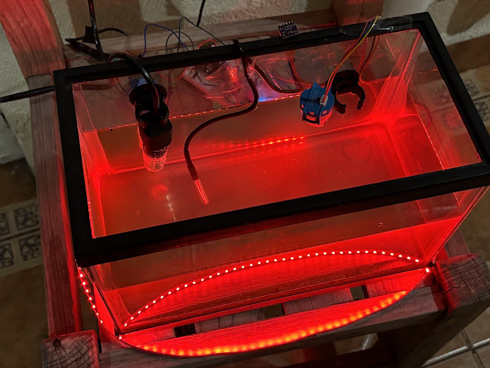
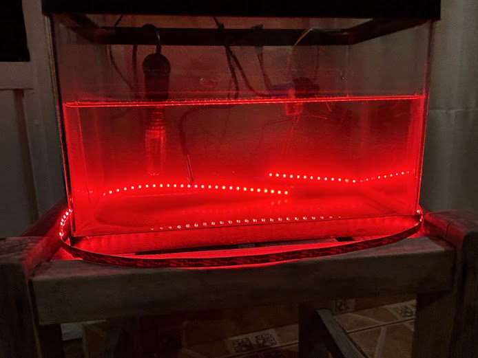
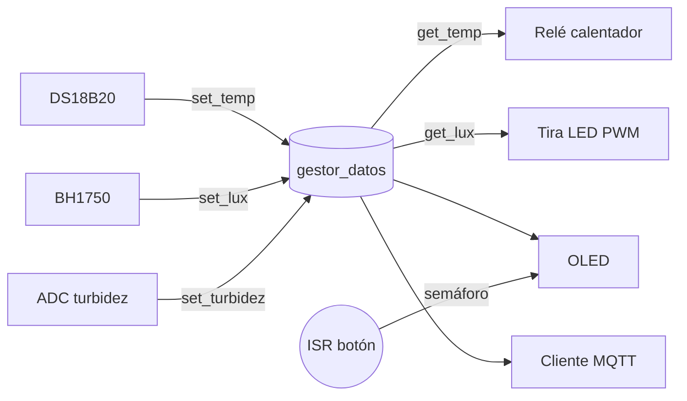
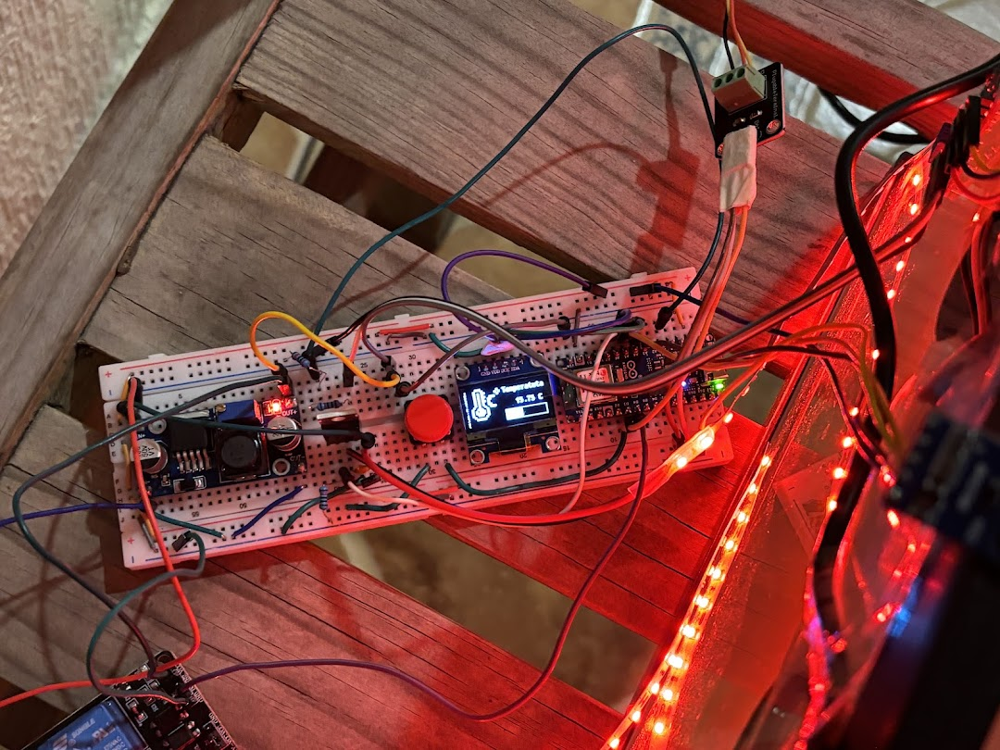
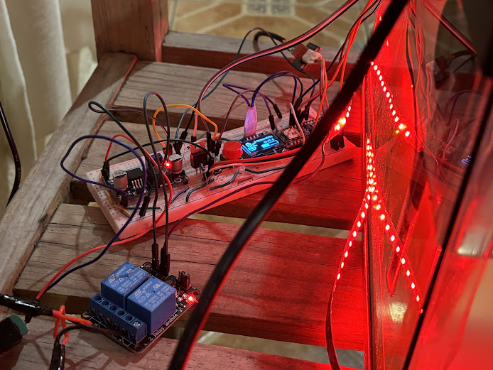
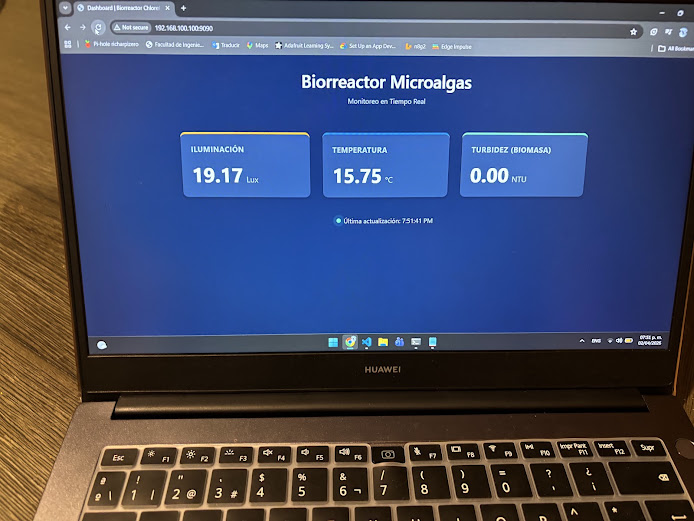

| Supported Targets | ESP32-S3 |
| ----------------- | -------- |

# Biorreactor de Microalgas

[English](README.md) | [Español](README.es.md)

Firmware en ESP-IDF para un biorreactor de microalgas pequeño basado en un ESP32-S3. Mide la temperatura del agua (DS18B20), la luz que recibe el cultivo (BH1750) y la turbidez (sensor analógico). Con esos datos mantiene el cultivo caliente con un calentador controlado por relé, complementa la luz con una tira LED roja, muestra las lecturas en una pantalla OLED de 128×64 y las publica por MQTT cada 30 segundos.

El proyecto tiene el fin de cultivar algas y mantenerlas en buen estado para posteriormente usarlas como combustible o darles otras utilidades. Para eso el biorreactor monitorea las variables críticas para su crecimiento y actúa sobre dos de ellas, temperatura y luz. La turbidez se usa como indicador de la biomasa.

<p align="center">
  
  
</p>

Empezó como proyecto final de la materia de Sistemas Embebidos en la Facultad de Ingeniería de la UAEMex.

## Cómo funciona

Cada sensor y actuador corre en su propia tarea de FreeRTOS. Los sensores nunca hablan directamente con los actuadores: escriben su último valor en un gestor de datos (`componentes/gestor/gestor_datos.c`), con un mutex por variable, y todos los demás leen de ahí.



| Tarea             | Archivo               | Núcleo | Prioridad | Periodo |
|-------------------|-----------------------|:------:|:---------:|---------|
| `Temperatura`     | `DS18B20_temp.c`      | 1      | 2         | 300 ms  |
| `sensor_luz`      | `bh1750_luz.c`        | 0      | 2         | 500 ms  |
| `sensor_turbidez` | `turbidez.c`          | 1      | 2         | 500 ms  |
| `relay`           | `calentador_relay.c`  | 1      | 3         | 500 ms  |
| `led`             | `tira_led_roja.c`     | 1      | 3         | ~3.3 s  |
| `oled_pantalla`   | `pantalla_oled.c`     | 1      | 1         | 200 ms  |
| `mqtt_cleinte`    | `cliente_mqtt.c`      | 0      | 3         | 30 s    |

**Calentador.** Control on/off con histéresis: el relé enciende a 23.5 °C o menos y apaga a 24.5 °C o más, con al menos 30 s entre conmutaciones para no castigar el relé. El módulo de relé es activo en bajo y arranca apagado.

**Luz.** La tira LED se controla con LEDC a 5 kHz y 12 bits. Entre menos luz ambiental mide el BH1750, más brilla la tira:

| Luz medida         | Duty (de 4095) |
|--------------------|:--------------:|
| < 3 000 lx         | 3072 (75 %)    |
| 3 000 – 12 000 lx  | 2048 (50 %)    |
| 12 000 – 30 000 lx | 1024 (25 %)    |
| > 30 000 lx        | 100 (~2 %)     |

**Turbidez.** La lectura del ADC (12 bits, atenuación de 12 dB) se reescala al voltaje real del sensor con el factor del divisor (1.51) y se convierte a NTU con la curva característica del sensor:

```
NTU = -1120.4·V² + 5742.3·V − 4353.8     para 2.5 V < V < 4.2 V
```

Arriba de 4.2 V se considera agua clara (0 NTU); abajo de 2.5 V el valor se satura en 3000 NTU.

**Pantalla.** Una OLED SH1106 de 128×64 con u8g2 muestra tres pantallas: turbidez (con una animación de alga y burbujas), luz (icono según el nivel y una barra) y temperatura (termómetro y barra de 0 a 40 °C). El botón en el GPIO 5 dispara una ISR con antirrebote de 200 ms que libera un semáforo binario; la tarea de la pantalla lo toma sin bloquearse y pasa a la siguiente pantalla.

**I²C.** La OLED y el BH1750 comparten un solo `i2c_master_bus` en el puerto 0, que se crea una vez en `I2c_bus_compartido.c`. Ambos drivers agregan su dispositivo a ese bus en lugar de crear uno propio.

## Uso

### Hardware necesario

<p align="center">
  
</p>

| Componente                    | Función                           | Interfaz     |
|-------------------------------|-----------------------------------|--------------|
| Placa ESP32-S3                | Controlador principal             |              |
| DS18B20, sonda sumergible     | Temperatura del agua              | 1-Wire (RMT) |
| BH1750                        | Luz incidente (lux)               | I²C          |
| Sensor de turbidez analógico  | Turbidez (NTU), hasta ~4.5 V      | ADC1         |
| OLED SH1106 128×64            | Pantalla local                    | I²C (0x3C)   |
| Botón                         | Cambiar de pantalla               | GPIO + ISR   |
| Módulo relé (activo en bajo)  | Enciende el calentador            | GPIO         |
| Tira LED roja + MOSFET        | Iluminación del cultivo           | PWM (LEDC)   |

El sensor de turbidez entrega hasta ~4.5 V, así que pasa por un divisor de voltaje (factor 1.51) antes de llegar al ADC de 3.3 V.

Asignación de pines, tomada de `main/main.c`:

| Señal                   | GPIO                              |
|-------------------------|-----------------------------------|
| I²C SDA (OLED + BH1750) | 11                                |
| I²C SCL (OLED + BH1750) | 12                                |
| Botón de pantalla       | 5 (pull-down, flanco de bajada)   |
| Turbidez (analógico)    | 2 (`ADC1_CHANNEL_1`)              |
| DS18B20 datos           | 6                                 |
| Relé del calentador     | 7                                 |
| PWM tira LED            | 13                                |

El diagrama de conexiones completo está en `docs/Projecto_bioreactorAlgas.fzz` (se abre con [Fritzing](https://fritzing.org/)).

<p align="center">
  
</p>

### Configuración

Los datos de Wi-Fi y del broker se pasan en `main/main.c` y no se suben al repo. Cambia los placeholders antes de compilar:

```c
Init_cliente_mqtt("SSID", "PASSWORD", "mqtt://<IP_BROKER>:1883");
```

Los buffers de `cliente_mqtt.h` aceptan como máximo 19 caracteres para el SSID, 19 para la contraseña y 39 para la URI del broker; si son más largos se recortan sin avisar.

### Compilación y flasheo

Compilado con ESP-IDF v5.5.3 (`dependencies.lock`). El componente `bh1750` requiere v5.3 o más reciente.

```sh
git clone https://github.com/LuisRIchar/proyecto_sistemas_embebidos_bioreactor_micro_algas.git
cd proyecto_sistemas_embebidos_bioreactor_micro_algas
. $IDF_PATH/export.sh
idf.py set-target esp32s3
idf.py build
idf.py -p PORT flash monitor
```

El IDF Component Manager descarga los componentes externos en `managed_components/` durante el primer build:

| Componente              | Versión | Uso             |
|-------------------------|---------|-----------------|
| `nixy4/u8g2`            | 0.1.4   | Gráficos OLED   |
| `espressif/bh1750`      | 2.0.0   | Sensor de luz   |
| `espressif/ds18b20`     | 0.3.0   | Temperatura     |
| `espressif/onewire_bus` | 1.0.4   | 1-Wire con RMT  |

## Salida

Cada 30 s el firmware publica una línea CSV en `bioreactor/sensores` con QoS 1:

```
<lux>,<temperatura_c>,<turbidez_ntu>
```

Para verla desde cualquier equipo de la red:

```sh
mosquitto_sub -h <IP_BROKER> -t "bioreactor/sensores" -v
```

La foto de abajo es un dashboard web aparte (no está en este repo) suscrito a ese tópico, mostrando 19.17 lx, 15.75 °C y 0.00 NTU de la pecera.

<p align="center">
  
</p>

## Problemas conocidos

El proyecto se desarrolló en sistemas de archivos que no distinguen mayúsculas. `componentes/gestor/CMakeLists.txt` pide `i2c_bus_compartido.c` pero el archivo se llama `I2c_bus_compartido.c`, y el código incluye `ds18b20_temp.h` cuando el archivo es `DS18B20_temp.h`. En Linux el build falla hasta que los nombres coincidan.

El código de turbidez usa la API heredada `driver/adc.h`, que ESP-IDF 5.x todavía compila pero marca como deprecada, así que salen warnings.

## Autor

Luis Ricardo Serrano Dzib, Facultad de Ingeniería, Universidad Autónoma del Estado de México (UAEMex).

## Licencia

Apache License 2.0. Ver [LICENSE](LICENSE).
