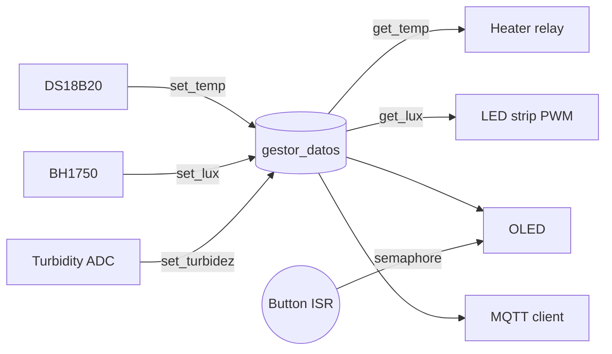

| Supported Targets | ESP32-S3 |
| ----------------- | -------- |

# Microalgae Bioreactor

[English](README.md) | [Español](README.es.md)

ESP-IDF firmware for a small microalgae bioreactor built around an ESP32-S3. It reads water temperature (DS18B20), incident light (BH1750) and turbidity (analog sensor), keeps the culture warm with a relay-driven heater, tops up the light with a red LED strip, shows the readings on a 128×64 OLED and publishes them over MQTT every 30 seconds.

The goal is to grow algae and keep them in good condition so they can later be used as fuel or for other applications. The bioreactor does this by monitoring the variables that matter most for growth and acting on two of them, temperature and light. Turbidity is tracked as a proxy for biomass.

<p align="center">
  
  
</p>

This started as the final project for the Embedded Systems course at the Facultad de Ingeniería, UAEMex.

## How it works

Each sensor and actuator runs in its own FreeRTOS task. Sensors never talk to actuators directly: they write their latest value into a small data manager (`componentes/gestor/gestor_datos.c`), one mutex per variable, and every consumer reads from there.



| Task              | Source                | Core | Priority | Period |
|-------------------|-----------------------|:----:|:--------:|--------|
| `Temperatura`     | `DS18B20_temp.c`      | 1    | 2        | 300 ms |
| `sensor_luz`      | `bh1750_luz.c`        | 0    | 2        | 500 ms |
| `sensor_turbidez` | `turbidez.c`          | 1    | 2        | 500 ms |
| `relay`           | `calentador_relay.c`  | 1    | 3        | 500 ms |
| `led`             | `tira_led_roja.c`     | 1    | 3        | ~3.3 s |
| `oled_pantalla`   | `pantalla_oled.c`     | 1    | 1        | 200 ms |
| `mqtt_cleinte`    | `cliente_mqtt.c`      | 0    | 3        | 30 s   |

**Heater.** On/off control with hysteresis: the relay turns on at 23.5 °C or below and off at 24.5 °C or above, with at least 30 s between switches so the relay is not chattering. The relay module is active-low and starts off.

**Light.** The LED strip is driven by LEDC at 5 kHz, 12-bit. The less ambient light the BH1750 sees, the brighter the strip:

| Measured light     | Duty (of 4095) |
|--------------------|:--------------:|
| < 3 000 lx         | 3072 (75 %)    |
| 3 000 – 12 000 lx  | 2048 (50 %)    |
| 12 000 – 30 000 lx | 1024 (25 %)    |
| > 30 000 lx        | 100 (~2 %)     |

**Turbidity.** The ADC reading (12-bit, 12 dB attenuation) is scaled back to the sensor's real output voltage through the divider factor of 1.51 and converted to NTU with the sensor's characteristic curve:

```
NTU = -1120.4·V² + 5742.3·V − 4353.8     for 2.5 V < V < 4.2 V
```

Above 4.2 V the water is taken as clear (0 NTU); below 2.5 V the value saturates at 3000 NTU.

**Display.** An SH1106 128×64 OLED driven with u8g2 cycles through three screens: turbidity (with an animated algae and bubbles), light (icon by level plus a bar) and temperature (thermometer plus a 0–40 °C bar). The button on GPIO 5 fires an ISR with a 200 ms debounce that gives a binary semaphore; the display task takes it without blocking and moves to the next screen.

**I²C.** The OLED and the BH1750 share one `i2c_master_bus` on port 0, created once in `I2c_bus_compartido.c`. Both drivers add their device to that bus instead of creating their own.

## How to use

### Hardware Required

<p align="center">
  
</p>

| Part                        | Role                         | Interface    |
|-----------------------------|------------------------------|--------------|
| ESP32-S3 board              | Main controller              |              |
| DS18B20, waterproof probe   | Water temperature            | 1-Wire (RMT) |
| BH1750                      | Incident light (lux)         | I²C          |
| Analog turbidity sensor     | Turbidity (NTU), up to ~4.5 V| ADC1         |
| SH1106 OLED 128×64          | Local display                | I²C (0x3C)   |
| Push button                 | Change screen                | GPIO + ISR   |
| Relay module (active-low)   | Switches the heater          | GPIO         |
| Red LED strip + MOSFET      | Grow light                   | PWM (LEDC)   |

The turbidity sensor outputs up to ~4.5 V, so it goes through a voltage divider (factor 1.51) before reaching the 3.3 V ADC.

Pin assignment, from `main/main.c`:

| Signal                  | GPIO                              |
|-------------------------|-----------------------------------|
| I²C SDA (OLED + BH1750) | 11                                |
| I²C SCL (OLED + BH1750) | 12                                |
| Screen button           | 5 (pull-down, falling edge)       |
| Turbidity (analog)      | 2 (`ADC1_CHANNEL_1`)              |
| DS18B20 data            | 6                                 |
| Heater relay            | 7                                 |
| LED strip PWM           | 13                                |

The full wiring is in `docs/Projecto_bioreactorAlgas.fzz` (open it with [Fritzing](https://fritzing.org/)).

<p align="center">
  
</p>

### Configure the Project

Wi-Fi and broker settings are passed in `main/main.c` and are not committed. Replace the placeholders before building:

```c
Init_cliente_mqtt("SSID", "PASSWORD", "mqtt://<BROKER_IP>:1883");
```

The buffers in `cliente_mqtt.h` hold at most 19 characters for the SSID, 19 for the password and 39 for the broker URI; longer values are silently truncated.

### Build and Flash

Built with ESP-IDF v5.5.3 (`dependencies.lock`). The `bh1750` component needs v5.3 or newer.

```sh
git clone https://github.com/LuisRIchar/proyecto_sistemas_embebidos_bioreactor_micro_algas.git
cd proyecto_sistemas_embebidos_bioreactor_micro_algas
. $IDF_PATH/export.sh
idf.py set-target esp32s3
idf.py build
idf.py -p PORT flash monitor
```

External components are fetched by the IDF Component Manager into `managed_components/` on the first build:

| Component               | Version | Used for        |
|-------------------------|---------|-----------------|
| `nixy4/u8g2`            | 0.1.4   | OLED graphics   |
| `espressif/bh1750`      | 2.0.0   | Light sensor    |
| `espressif/ds18b20`     | 0.3.0   | Temperature     |
| `espressif/onewire_bus` | 1.0.4   | 1-Wire over RMT |

## Example Output

Every 30 s the firmware publishes one CSV line to `bioreactor/sensores` with QoS 1:

```
<lux>,<temperature_c>,<turbidity_ntu>
```

To watch it from any machine on the network:

```sh
mosquitto_sub -h <BROKER_IP> -t "bioreactor/sensores" -v
```

The photo below is a separate web dashboard (not part of this repo) subscribed to that topic, showing 19.17 lx, 15.75 °C and 0.00 NTU from the tank.

<p align="center">
  
</p>

## Troubleshooting

The project was developed on case-insensitive file systems. `componentes/gestor/CMakeLists.txt` lists `i2c_bus_compartido.c` while the file is `I2c_bus_compartido.c`, and the sources include `ds18b20_temp.h` while the file is `DS18B20_temp.h`. On Linux the build fails until the file names and references match.

The turbidity code uses the legacy `driver/adc.h` API, which ESP-IDF 5.x still compiles but marks as deprecated, so expect warnings.

## Author

Luis Ricardo Serrano Dzib, Facultad de Ingeniería, Universidad Autónoma del Estado de México (UAEMex).

## License

Apache License 2.0. See [LICENSE](LICENSE).
