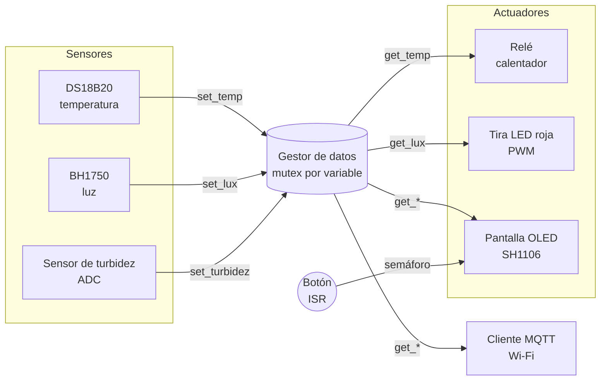

# Biorreactor de Microalgas — ESP32-S3

Firmware para un biorreactor de microalgas basado en **ESP32-S3** y **FreeRTOS (ESP-IDF)**. El sistema monitorea en tiempo real las variables críticas de cultivo (temperatura, luz y turbidez), controla de forma automática un calentador y una tira LED de iluminación, muestra los datos en una pantalla OLED y los publica por **MQTT** para su supervisión remota.

> Proyecto académico de la materia **Sistemas Embebidos** — Facultad de Ingeniería, UAEMex.

---

## Tabla de contenidos

1. [Objetivo](#objetivo)
2. [Características](#características)
3. [Arquitectura](#arquitectura)
4. [Hardware](#hardware)
5. [Estructura del repositorio](#estructura-del-repositorio)
6. [Descripción de los módulos](#descripción-de-los-módulos)
7. [Compilación y flasheo](#compilación-y-flasheo)
8. [Configuración de red y MQTT](#configuración-de-red-y-mqtt)
9. [Formato de datos MQTT](#formato-de-datos-mqtt)
10. [Trabajo futuro](#trabajo-futuro)
11. [Autores](#autores)
12. [Licencia](#licencia)

---

## Objetivo

Las microalgas tienen aplicaciones en biocombustibles, alimentación y tratamiento de agua, pero su crecimiento depende de mantener condiciones estables. Este biorreactor busca **automatizar el cuidado del cultivo**:

- **Temperatura** dentro de un rango óptimo, mediante un calentador controlado por relé.
- **Iluminación** suficiente, compensando la luz ambiental con una tira LED roja regulada por PWM.
- **Turbidez** monitoreada como indicador indirecto de la densidad (crecimiento) del cultivo.

## Características

- Arquitectura multitarea con **FreeRTOS**: cada sensor y actuador corre en su propia tarea, repartidas entre los dos núcleos del ESP32-S3.
- **Gestor de datos centralizado** con acceso protegido por *mutex* para evitar condiciones de carrera entre tareas.
- **Bus I²C compartido**: un único bus maestro para la pantalla OLED y el sensor de luz BH1750.
- **Control de temperatura con histéresis** y tiempo mínimo entre conmutaciones para proteger el relé.
- **Iluminación adaptativa**: el ciclo de trabajo PWM de la tira LED se ajusta según la luz medida.
- **Interfaz OLED** con tres pantallas (turbidez, luz y temperatura), navegables con un botón por **interrupción** + semáforo binario con antirrebote.
- **Telemetría MQTT** sobre Wi-Fi con reconexión automática.

## Arquitectura



Los sensores **escriben** en el gestor de datos y los actuadores **leen** de él; ningún módulo se comunica directamente con otro. Así cada componente queda desacoplado y es fácil agregar sensores o consumidores nuevos.

### Tareas de FreeRTOS

| Tarea              | Módulo              | Núcleo | Prioridad | Periodo   |
|--------------------|---------------------|:------:|:---------:|-----------|
| `Temperatura`      | `DS18B20_temp.c`    | 1      | 2         | 300 ms    |
| `sensor_luz`       | `bh1750_luz.c`      | 0      | 2         | 500 ms    |
| `sensor_turbidez`  | `turbidez.c`        | 1      | 2         | 500 ms    |
| `relay`            | `calentador_relay.c`| 1      | 3         | 500 ms    |
| `led`              | `tira_led_roja.c`   | 1      | 3         | ~3.3 s    |
| `oled_pantalla`    | `pantalla_oled.c`   | 1      | 1         | 200 ms    |
| `mqtt_cleinte`     | `cliente_mqtt.c`    | 0      | 3         | 30 s      |

## Hardware

### Componentes

| Componente                 | Función                          | Interfaz     |
|----------------------------|----------------------------------|--------------|
| ESP32-S3                   | Microcontrolador principal       | —            |
| DS18B20 (sumergible)       | Temperatura del medio de cultivo | 1-Wire (RMT) |
| BH1750                     | Intensidad luminosa (lux)        | I²C          |
| Sensor de turbidez (0–4.5 V) | Turbidez del cultivo (NTU)     | ADC1         |
| Pantalla OLED 128×64 SH1106 | Interfaz local                  | I²C (0x3C)   |
| Botón pulsador             | Cambio de pantalla               | GPIO + ISR   |
| Módulo relé (activo en bajo) | Encendido del calentador       | GPIO         |
| Tira LED roja + MOSFET     | Iluminación del cultivo          | PWM (LEDC)   |

El diagrama de conexiones está en [`docs/Projecto_bioreactorAlgas.fzz`](docs/Projecto_bioreactorAlgas.fzz) (abrir con [Fritzing](https://fritzing.org/)).

### Asignación de pines

Definida en [`main/main.c`](main/main.c):

| Señal                   | GPIO ESP32-S3          |
|-------------------------|------------------------|
| I²C SDA (OLED + BH1750) | 11                     |
| I²C SCL (OLED + BH1750) | 12                     |
| Botón de pantalla       | 5 (pull-down, flanco de bajada) |
| Turbidez (analógico)    | 2 (`ADC1_CHANNEL_1`)   |
| DS18B20 (1-Wire)        | 6                      |
| Relé del calentador     | 7                      |
| Tira LED (PWM)          | 13                     |

> ⚠️ El sensor de turbidez entrega hasta ~4.5 V. Se usa un **divisor de voltaje** (factor 1.51) para no exceder los 3.3 V del ADC del ESP32-S3.

## Estructura del repositorio

```
.
├── CMakeLists.txt              # Proyecto ESP-IDF; registra los componentes propios
├── dependencies.lock           # Versiones fijadas de los componentes externos
├── sdkconfig                   # Configuración de ESP-IDF (target esp32s3)
├── main/
│   ├── main.c                  # Punto de entrada: inicializa todos los módulos
│   └── idf_component.yml       # Dependencias del IDF Component Manager
├── componentes/
│   ├── gestor/                 # Infraestructura compartida
│   │   ├── gestor_datos.c/.h       # Almacén de datos con mutex
│   │   ├── I2c_bus_compartido.c/.h # Bus I²C maestro único
│   │   └── cliente_mqtt.c/.h       # Wi-Fi STA + cliente MQTT
│   ├── sensores/
│   │   ├── DS18B20_temp.c/.h       # Temperatura (1-Wire)
│   │   ├── bh1750_luz.c/.h         # Luz (I²C)
│   │   └── turbidez.c/.h           # Turbidez (ADC)
│   └── actuadores/
│       ├── calentador_relay.c/.h   # Control on/off con histéresis
│       ├── tira_led_roja.c/.h      # PWM adaptativo
│       ├── pantalla_oled.c/.h      # Interfaz gráfica + botón
│       └── u8g2_esp32_hal.c/.h     # HAL de u8g2 sobre el bus I²C compartido
└── docs/
    └── Projecto_bioreactorAlgas.fzz  # Esquemático (Fritzing)
```

## Descripción de los módulos

### Gestor de datos (`gestor/gestor_datos`)
Guarda la última lectura de cada sensor (`ntu`, `lux`, `val_temp`), cada una con su propio **mutex**. Expone una API `set_*()` / `get_*()` para que productores (sensores) y consumidores (actuadores, pantalla, MQTT) nunca toquen las variables directamente.

### Bus I²C compartido (`gestor/I2c_bus_compartido`)
Crea **un solo** `i2c_master_bus` (puerto 0, pull-ups internos) y entrega su *handle* a quien lo pida. Tanto el BH1750 como la HAL de la pantalla agregan su dispositivo a este bus en lugar de crear uno propio, lo que evita conflictos de inicialización.

### Temperatura — DS18B20
Enumera el primer dispositivo del bus 1-Wire (implementado con el periférico **RMT**), dispara la conversión y publica la temperatura cada 300 ms.

### Luz — BH1750
Modo de medición continua con resolución de 1 lx. Rangos de referencia usados en el proyecto:
- Bajo: 1 000 – 3 000 lx
- Medio: 3 000 – 10 000 lx
- Alto: > 10 000 lx

### Turbidez
Lee el ADC (12 bits, atenuación 12 dB), reconstruye el voltaje real del sensor y lo convierte a **NTU** con la curva característica del fabricante:

```
NTU = -1120.4·V² + 5742.3·V − 4353.8     (2.5 V < V < 4.2 V)
```

Por encima de 4.2 V se considera agua clara (0 NTU) y por debajo de 2.5 V se satura en 3000 NTU.

### Calentador — relé
Control **on/off con histéresis** para mantener el cultivo entre ~23.5 °C y 24.5 °C:
- Enciende si `T ≤ 23.5 °C`.
- Apaga si `T ≥ 24.5 °C`.
- Respeta un **intervalo mínimo de 30 s** entre conmutaciones para no desgastar el relé.
- El relé es **activo en bajo** (`0` = encendido) y arranca apagado.

### Tira LED roja — PWM
LEDC a 5 kHz y 12 bits. La intensidad compensa la luz ambiental:

| Luz medida        | Duty (de 4095) |
|-------------------|:--------------:|
| < 3 000 lx        | 3072 (75 %)    |
| 3 000 – 12 000 lx | 2048 (50 %)    |
| 12 000 – 30 000 lx| 1024 (25 %)    |
| > 30 000 lx       | 100 (~2 %)     |

### Pantalla OLED
Usa la librería **u8g2** con un controlador SH1106 de 128×64. Tiene tres pantallas, cada una con gráficos XBM:
1. **Turbidez** — valor en NTU con una animación de algas y burbujas.
2. **Luz** — icono según el nivel, valor en lux y barra de intensidad.
3. **Temperatura** — termómetro, valor en °C y barra (escala 0–40 °C).

El botón dispara una **ISR** con antirrebote de 200 ms que libera un **semáforo binario**. La tarea de la pantalla lo consume sin bloquearse y avanza a la siguiente pantalla.

### Cliente MQTT
Inicializa NVS, se conecta a Wi-Fi en modo estación (reintenta si se cae la conexión) y arranca el cliente MQTT cuando obtiene una IP. Cada 30 s publica las tres lecturas.

## Compilación y flasheo

### Requisitos
- [ESP-IDF **v5.5**](https://docs.espressif.com/projects/esp-idf/en/v5.5/esp32s3/get-started/) (el proyecto se generó con 5.5.3; `bh1750` requiere ≥ 5.3).
- Placa ESP32-S3.

### Pasos

```bash
# 1. Clonar el repositorio
git clone https://github.com/LuisRIchar/proyecto_sistemas_embebidos_bioreactor_micro_algas.git
cd proyecto_sistemas_embebidos_bioreactor_micro_algas

# 2. Activar el entorno de ESP-IDF
. $IDF_PATH/export.sh

# 3. Seleccionar el target (ya viene en sdkconfig, pero no estorba)
idf.py set-target esp32s3

# 4. Compilar — las dependencias externas se descargan solas
idf.py build

# 5. Flashear y abrir el monitor serie
idf.py -p <PUERTO> flash monitor
```

Las dependencias se resuelven automáticamente con el **IDF Component Manager** a partir de `main/idf_component.yml` y `dependencies.lock`, y se descargan en `managed_components/` (carpeta ignorada por git):

| Componente              | Versión | Uso                  |
|-------------------------|---------|----------------------|
| `nixy4/u8g2`            | 0.1.4   | Gráficos OLED        |
| `espressif/bh1750`      | 2.0.0   | Sensor de luz        |
| `espressif/ds18b20`     | 0.3.0   | Sensor de temperatura|
| `espressif/onewire_bus` | 1.0.4   | Bus 1-Wire (RMT)     |

## Configuración de red y MQTT

Las credenciales **no** se versionan. Antes de compilar, edita la llamada en [`main/main.c`](main/main.c):

```c
Init_cliente_mqtt("SSID", "PASSWORD", "mqtt://<IP_BROKER>:1883");
```

> Límites actuales del buffer: SSID ≤ 19 caracteres, contraseña ≤ 19, URI del broker ≤ 39.

Para pruebas locales sirve cualquier broker, por ejemplo [Mosquitto](https://mosquitto.org/):

```bash
mosquitto_sub -h <IP_BROKER> -t "bioreactor/sensores" -v
```

## Formato de datos MQTT

| Campo    | Valor                       |
|----------|-----------------------------|
| Tópico   | `bioreactor/sensores`       |
| QoS      | 1                           |
| Periodo  | 30 s                        |
| Payload  | `luz,temperatura,turbidez` (CSV) |

Ejemplo:

```
5234.17,24.06,12.85
```

## Trabajo futuro

- Mover las credenciales a `menuconfig` (`Kconfig.projbuild`) para no editar el código fuente.
- Publicar en formato JSON y usar TLS (`mqtts://`).
- Migrar el sensor de turbidez del driver ADC heredado (`driver/adc.h`) a `esp_adc/adc_oneshot.h`, con calibración.
- Hacer configurables los umbrales de temperatura e iluminación (por MQTT o NVS).
- Agregar control de pH, CO₂ y fotoperiodo programado.
- Unificar en minúsculas los nombres de `I2c_bus_compartido.*` y `DS18B20_temp.*` para que compile en sistemas de archivos sensibles a mayúsculas (Linux/CI).

## Autores

- **Luis Ricardo Serrano Dzib**
- **Aram Gonzales Ronquillo**

Facultad de Ingeniería — Universidad Autónoma del Estado de México (UAEMex).

## Licencia

Distribuido bajo la licencia **Apache 2.0**. Consulta [`LICENSE`](LICENSE).
